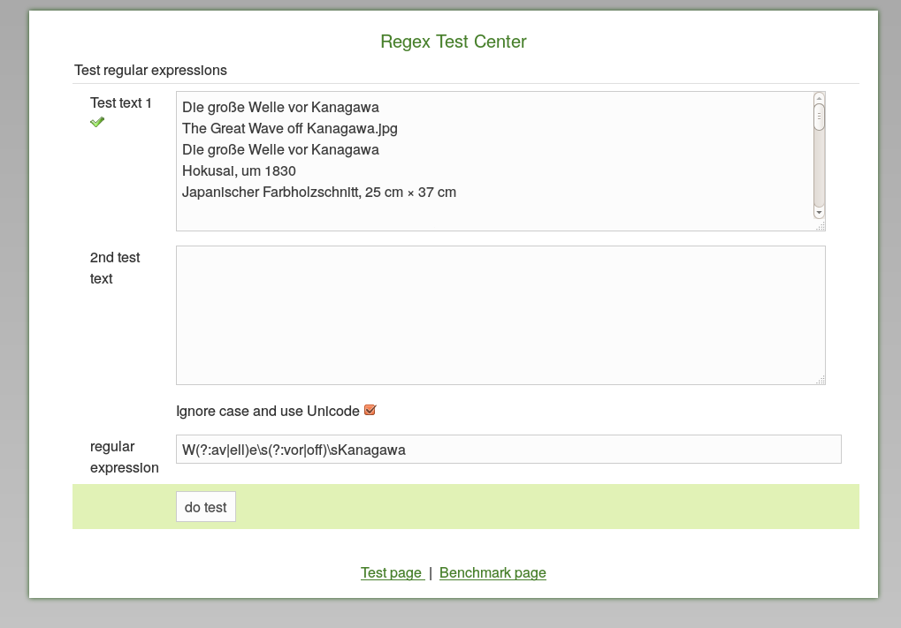
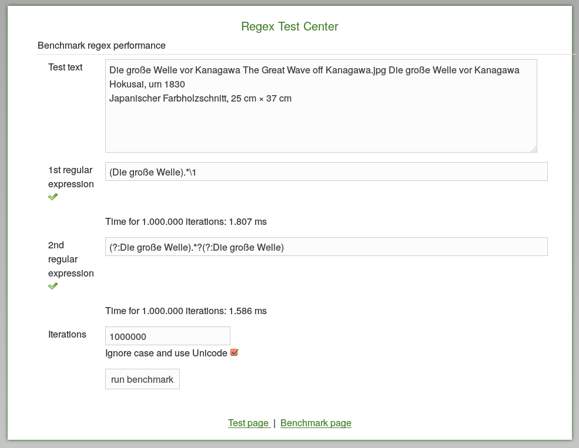

# RegEchse

RegEchse is a simple webapp to test and benchmark Java regular expressions.

It currently contains two pages, one for testing and one for benchmarking.

## Version

This is version 0.2

# Installation

At the moment, you need a working Grails environment (see: http://grails.org).
Running the programm locally with "grails run-app" will allow you to access the app under http://localhost:8080/regEchse .

# License

Gnu Public License v3 http://www.gnu.org/copyleft/gpl.html

# Author

Ingo Wiarda

# Contact

Email: ingo_wiarda@dewarim.de

